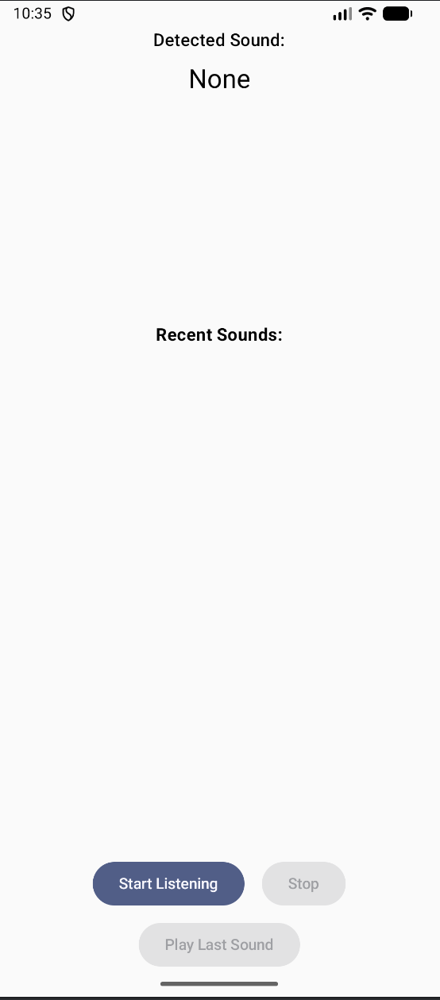
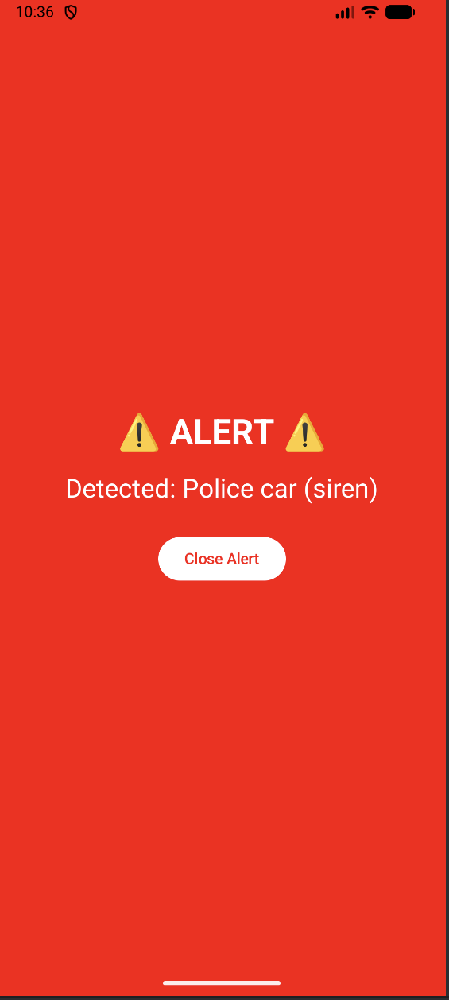
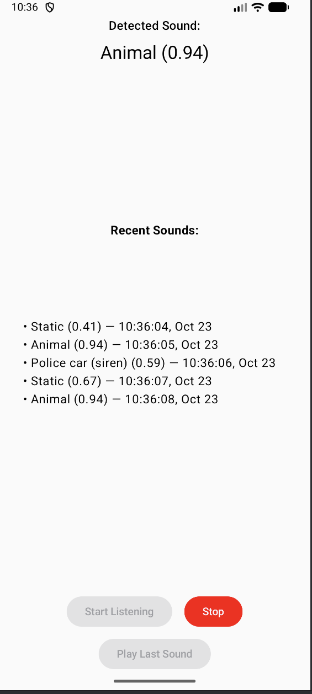

# SoundSense: An Android Sound Classification App

SoundSense is an Android application built with Kotlin and Jetpack Compose that uses machine learning to listen to the environment and classify sounds in real-time. It is specifically designed to identify and trigger alerts for critical sounds, making it a powerful accessibility tool for users who are hard of hearing.

<p align="center">
  
  
  
</p>

## Features

-   **Real-Time Sound Classification**: Uses the device's microphone to continuously listen and identify ambient sounds using the YAMNet model.
-   **Critical Sound Alerts**: Triggers a full-screen, high-visibility alert with strong vibration when a critical sound is detected (e.g., sirens, fire alarms, baby crying).
-   **Recent Sounds History**: Displays a live-updating list of the five most recently detected sounds.
-   **Audio Playback**: Allows the user to play back the last recorded sound chunk for verification.
-   **Emulator-Safe Testing**: Includes a robust mock audio helper that can cycle through generated noise and pre-recorded MP3 files, allowing for full-featured testing on an Android emulator without a real microphone.
-   **Modern Android Tech Stack**: Built entirely with Kotlin, Jetpack Compose for the UI, and Coroutines for background processing.

## How It Works

The application operates in a continuous loop managed by a Kotlin Coroutine. In each cycle, it captures a ~1-second audio clip. This raw audio data is then passed to a pre-trained TensorFlow Lite model (YAMNet), which returns a list of possible sounds and their confidence scores.

The app then processes this result:
1.  If a sound is detected with sufficient confidence, its name and timestamp are added to the "Recent Sounds" list.
2.  If the detected sound's label matches a keyword in the `alertKeywords` list (e.g., "Siren", "Alarm"), a full-screen `AlertScreen` is triggered.
3.  The raw audio from the last classification is saved as a `.wav` file, which can be played back at any time.

## Technology Stack

-   **Language**: [Kotlin](https://kotlinlang.org/)
-   **UI**: [Jetpack Compose](https://developer.android.com/jetpack/compose)
-   **Asynchronous Programming**: [Kotlin Coroutines](https://kotlinlang.org/docs/coroutines-overview.html)
-   **Machine Learning**: [TensorFlow Lite for Android](https://www.tensorflow.org/lite/android)
-   **Audio Classification Model**: [YAMNet](https://tfhub.dev/google/yamnet/1)
-   **Audio Processing**: Android `AudioRecord` for capture, `MediaCodec` and `MediaExtractor` for decoding mock files.

## Project Structure

```
MyApplication/
└── app/
    ├── src/
    │   └── main/
    │       ├── assets/
    │       │   ├── yamnet.tflite         # The TFLite sound classification model
    │       │   └── yamnet_class_map.csv  # Maps model output to human-readable labels
    │       │
    │       ├── java/com/example/myapplication/
    │       │   ├── MainActivity.kt               # Main UI, state management, and logic loop
    │       │   ├── AudioClassificationHelper.kt  # Interface for audio helpers
    │       │   ├── AudioHelper.kt                # Implementation for REAL microphone audio
    │       │   ├── MockAudioHelper.kt            # Implementation for MOCK test audio
    │       │   └── LabelMapHelper.kt             # Helper to parse the class map CSV
    │       │
    │       └── res/
    │           └── raw/
    │               ├── audio1.mp3        # Your first test audio file
    │               └── audio2.mp3        # Your second test audio file
    │
    └── build.gradle.kts                # App-level build script with dependencies
```

## Setup and Running

1.  **Clone the Repository**
    
    ```sh
    git clone https://github.com/your-username/soundsense.git
    ```

2.  **Open in Android Studio**
    -   Open Android Studio and choose "Open an existing project."
    -   Navigate to the cloned repository folder and open it.

3.  **Add Mock Audio Files (Optional but Recommended)**
    -   Create a `raw` directory under `app/src/main/res/`.
    -   Place your test audio files (e.g., `audio1.mp3`, `audio2.mp3`) inside this `res/raw` directory.
    -   **Important**: These files must be encoded as **16kHz Mono** audio for the decoder to work correctly.

4.  **Build and Run**
    -   You can now build and run the app on a physical Android device or an emulator.

### Testing on the Emulator (Using Mock Audio)

The emulator's microphone is unreliable for real-time recording. This project is set up to easily switch to a mock audio provider for testing.

To enable the mock helper, open `app/src/main/java/com/example/myapplication/MainActivity.kt` and change the following line:

```kotlin
// --- The ONLY line you need to change for testing ---

// For real device:
// audioHelper = AudioHelper(this)

// For emulator testing:
audioHelper = MockAudioHelper(this)
```

The `MockAudioHelper` will cycle through three sources: random noise, `audio1.mp3`, and `audio2.mp3`. This allows you to test the UI, alerts, and playback features without a physical microphone.
